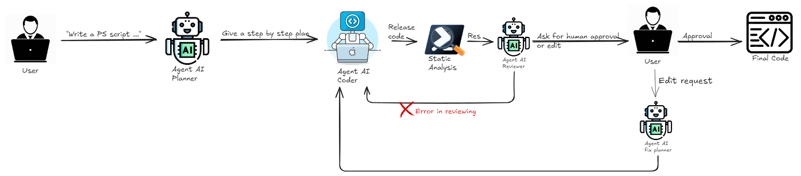

# Agentic Self-Evaluation and Human In The Loop System for PowerShell Code Generation <!-- omit in toc -->

## Table of Contents <!-- omit in toc -->
<!-- TOC -->
- [Overview](#overview)
- [Architettura del Sistema](#architettura-del-sistema)
- [Workflow](#workflow)
- [Code Quality Evaluation](#code-quality-evaluation)
- [Tecniche Utilizzate](#tecniche-utilizzate)
- [Note](#note)
<!-- /TOC -->

## Overview

Questo progetto implementa un sistema agentico multi-ruolo basato su CrewAI, progettato per generare, valutare e correggere automaticamente codice PowerShell con interazione umana opzionale nel ciclo di revisione.
Il sistema sfrutta tecniche di Chain-of-Thought (CoT) e un approccio di self-evaluation, combinando analisi automatica del codice (tramite PSScriptAnalyzer) e revisione umana per affinare progressivamente gli script generati.

## Architettura del Sistema

Il sistema è composto da quattro agents principali, ognuno con un ruolo definito:

| Agent                 | Ruolo                  | Descrizione                                                                                                 |
| --------------------- | ---------------------- | ----------------------------------------------------------------------------------------------------------- |
| 🧩 **Planner**        | Pianificazione         | Traduce la richiesta dell’utente in un piano d’azione atomico (6-9 passi sequenziali).                      |
| 💻 **Coder**          | Generazione            | Converte il piano in uno script PowerShell completo e funzionante.                                          |
| 🔍 **Reviewer**       | Valutazione automatica | Analizza lo script tramite *PSScriptAnalyzer* per rilevare errori di sintassi, parsing o regole di stile.   |
| ✏️ **Change Planner** | Revisione guidata      | Interpreta le modifiche richieste dall’utente e produce *FIX NOTES* che il Coder applica come mirate. |

## Workflow

1. **Input utente**
    - L’utente inserisce una richiesta in linguaggio naturale (es. “Crea uno script che mostra più finestre di popup con messaggi casuali”).

2. **Planning**
    - Il Planner converte la richiesta in un piano strutturato step-by-step, focalizzato su azioni deterministiche.

3. **Code Generation**
    - Il Coder genera il codice PowerShell seguendo il piano fornito, producendo un file .ps1 eseguibile.

4. **Static Analysis**
    - Lo script viene analizzato automaticamente dal modulo PSScriptAnalyzer, che restituisce un report JSON contenente eventuali errori di parsing o warning.

5. **AI Review & Auto-Fix Loop**
    - Il Reviewer interpreta il report e, se necessario, genera *FIX NOTES* che il Coder applica per correggere automaticamente il codice.
    - Il ciclo code → analyze → review → fix si ripete fino a un massimo di 3 iterazioni (arbitrario).

6. **Human-in-the-Loop Gate**
    - Una volta superata l’analisi automatica, l’utente può:
        - accettare lo script finale;
        - visualizzarlo a schermo;
        - richiedere modifiche testuali (“Cambia il messaggio del popup”, “Aggiungi log su file”).
    - Le modifiche vengono tradotte dal Change Planner in nuovi FIX NOTES, generando un nuovo ciclo di miglioramento controllato.

7. **Output finale**
    - Quando l’utente approva, il sistema salva lo script .ps1 definitivo e chiude il processo.

## Code Quality Evaluation

Per valutare la qualità e la similarità dei codici generati, il progetto include un modulo di valutazione automatica basata su metriche linguistiche e strutturali, implementato in `test_evaluation_json_token_complete.py` (vedi cartella *evaluation_metrics*)

Le metriche utilizzate sono:

| Metrica                      | Descrizione                                           | Libreria                |
| ---------------------------- | ----------------------------------------------------- | ----------------------- |
| **BLEU-1 / BLEU-2 / BLEU-4** | Similarità n-gram tra codice generato e riferimento   | `nltk`                  |
| **ROUGE-L**                  | Similarità di sequenze (Longest Common Subsequence)   | `rouge_score`           |
| **METEOR**                   | Similarità parole con la stessa radice o varianti linguistiche          | `nltk`                  |
| **Edit Distance**            | Differenza minima in termini di token                 | `nltk.metrics.distance` |
| **chrF**                     | Similarità a livello di caratteri (basata su F-score) | `sacrebleu`             |

## Tecniche Utilizzate

- **Multi-Agent** Reasoning con ruoli distinti e cooperanti.

- **Chain-of-Thought** (CoT) per la pianificazione strutturata e il reasoning esplicito.

- **Self-Evaluation Loop** basato su PSScriptAnalyzer.

- **Human-in-the-Loop** Feedback per la rifinitura iterativa.

- **Automated Quality Metrics** per confronto quantitativo tra codice reale e generato.

## Note

Questo progetto è rilasciato per scopi di ricerca e sperimentazione accademica.
Non utilizzare per la generazione automatica di codice malevolo o potenzialmente pericoloso.