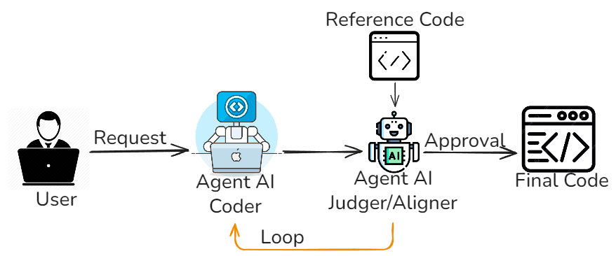

# Overview
Questa cartella contiene la versione `pssai_coder_judger` della pipeline multi-agente.

L'architettura usa due agenti principali:

- `Coder`: genera o modifica script PowerShell eseguibili.
- `Code Similarity Aligner` (Judger): confronta codice candidato e reference, e produce eventuali `fix_notes` minime.

Il flusso principale è implementato in `multi_agent_architecture.py`.

## Diagramma Architettura


### Flusso di esecuzione
1. Il programma valida due LLM (`Coder` e `Aligner`) e legge input utente da CLI.
2. Il `Coder` genera una prima versione dello script PowerShell a partire dalla richiesta (`iter1`), che viene salvata su file.
3. Se viene passato `--ref`, l'`Aligner` confronta codice candidato e reference:
   - se `status=ok`, il flusso termina con il candidato corrente;
   - se `status=retry`, produce `fix_notes`.
4. In caso di `fix_notes`, il `Coder` rigenera lo script applicando le modifiche richieste e salva una nuova versione.
5. L'output finale è il path dello script `.ps1` più recente generato dal processo.

## Esecuzione Rapida
```bash
pip install -r requirements.txt
python multi_agent_architecture.py "Descrizione dello script da generare"
python multi_agent_architecture.py --ref percorso\reference.ps1 "Descrizione dello script da generare"
```
