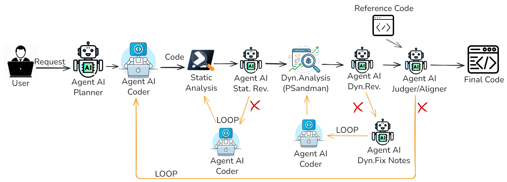

# Overview
Questa cartella contiene la versione `pssai_complete` della pipeline multi-agente.

L'architettura usa cinque agenti principali:

- `Planner`: trasforma la richiesta utente in un piano operativo minimale (6-9 passi).
- `Coder`: genera o aggiorna lo script PowerShell eseguibile.
- `Static Analysis Reviewer`: valuta il report di `PSScriptAnalyzer` e produce `fix_notes` mirate.
- `Dynamic Execution Reviewer`: analizza le evidenze runtime generate da `psandman` e decide pass/fail.
- `Code Similarity Aligner`: confronta candidato e reference (`--ref`) per allineamento semantico e strutturale.

Il flusso principale e implementato in `multi_agent_architecture.py`.

## Diagramma Architettura


### Flusso di esecuzione
1. Il programma valida `OPENAI_API_KEY`, controlla i path di `psandman`, legge la richiesta CLI e opzionalmente il file reference (`--ref`).
2. Il `Planner` produce il piano canonico; da questo piano vengono derivati gli invarianti da preservare in tutte le iterazioni.
3. Parte il loop globale con due gate principali:
   - `Static gate`: `Coder` genera script, `PSScriptAnalyzer` lo analizza, `Static Reviewer` produce fix se necessario.
   - `Dynamic gate`: `psandman` esegue lo script e raccoglie evidenze, `Dynamic Reviewer` valuta pass/fail, e in caso di fail il `Change Planner` fornisce fix da riapplicare al `Coder`.
4. Se e presente `--ref`, viene eseguito lo stage di `Alignment`:
   - se `status=ok`, il flusso termina;
   - se `status=retry`, vengono generate `fix_notes` di allineamento e parte una nuova iterazione globale (entro i limiti impostati).
5. A fine esecuzione viene salvato lo script finale e un report di osservabilità.

## Esecuzione Rapida
```bash
pip install -r requirements.txt
python multi_agent_architecture.py "Descrizione dello script da generare"
python multi_agent_architecture.py --ref percorso\reference.ps1 "Descrizione dello script da generare"
```
