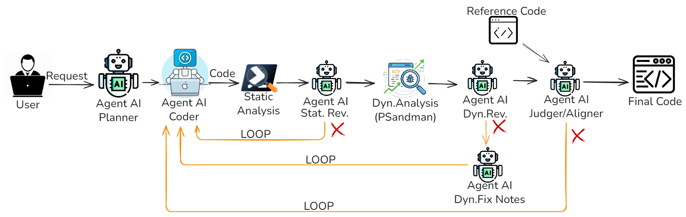

# Overview
Questa cartella contiene la versione `pssai_complete_nested` della pipeline multi-agente.

L'architettura usa cinque agenti principali:

- `Planner`: trasforma la richiesta utente in un piano operativo minimale (6-9 passi).
- `Coder`: genera o aggiorna lo script PowerShell eseguibile.
- `Static Analysis Reviewer`: valuta il report di `PSScriptAnalyzer` e produce `fix_notes` mirate.
- `Dynamic Execution Reviewer`: analizza le evidenze runtime generate da `psandman` e decide pass/fail.
- `Code Similarity Aligner`: confronta candidato e reference (`--ref`) per allineamento semantico e strutturale.

Il flusso principale e implementato in `multi_agent_architecture.py`.

## Diagramma Architettura


### Flusso di esecuzione
1. Il programma valida `OPENAI_API_KEY`, controlla i path fissi di `psandman`, legge la richiesta CLI e opzionalmente il file reference (`--ref`).
2. Il `Planner` produce il piano canonico; dal piano vengono derivati gli invarianti da preservare in tutte le iterazioni.
3. Parte il ciclo principale:
   - con `--ref`: ciclo globale;
   - senza `--ref`: una sola iterazione globale (nessuna fase di alignment).
4. Nel gate statico il `Coder` genera/aggiorna lo script, `PSScriptAnalyzer` lo verifica, e lo `Static Reviewer` propone fix in caso di errore.
5. Nel gate dinamico `psandman` esegue lo script e il `Dynamic Reviewer` valuta il risultato:
   - se `pass`, si prosegue;
   - se `fail`, il `Change Planner` produce fix dinamiche, il `Coder` le applica e il flusso riparte dal gate statico (comportamento nested).
6. In fase di `Alignment` (se `--ref` e presente), l'`Aligner` confronta candidato e reference:
   - se `status=ok`, il flusso termina;
   - se `status=retry`, vengono applicate `fix_notes` di allineamento tramite `Coder` e il flusso riparte dal gate statico, consumando una iterazione globale.
7. L'output finale è lo script più recente.

## Esecuzione Rapida
```bash
pip install -r requirements.txt
python multi_agent_architecture.py "Descrizione dello script da generare"
python multi_agent_architecture.py --ref percorso\reference.ps1 "Descrizione dello script da generare"
```
