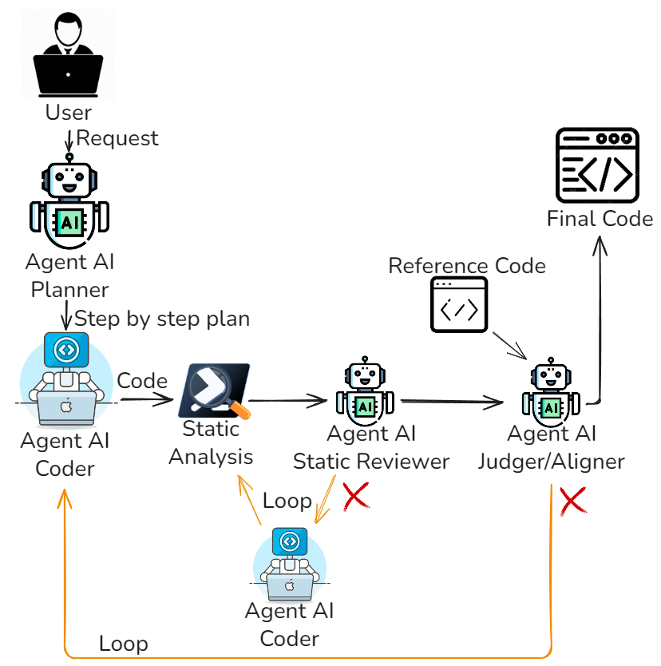

# Overview
Questa cartella contiene la versione `pssai_no_dynamic` della pipeline multi-agente.

L'architettura usa quattro agenti principali:

- `Planner`: trasforma la richiesta utente in un piano operativo minimale (6-9 passi).
- `Coder`: genera o aggiorna lo script PowerShell eseguibile.
- `Static Analysis Reviewer`: valuta il report di `PSScriptAnalyzer` e produce `fix_notes` mirate.
- `Code Similarity Aligner`: confronta candidato e reference (`--ref`) per allineamento semantico e strutturale.

Il flusso principale e implementato in `multi_agent_architecture.py`.

## Diagramma Architettura


### Flusso di esecuzione
1. Il programma legge la richiesta CLI, opzionalmente il file reference (`--ref`) e avvia il `Planner`.
2. Il `Planner` produce il piano canonico; dal piano vengono derivati gli invarianti da preservare in tutte le iterazioni.
3. Parte il ciclo globale con gate statico:
   - il `Coder` genera/aggiorna lo script;
   - il gate statico esegue `PSScriptAnalyzer`;
   - se fallisce, lo `Static Reviewer` produce `fix_notes` che vengono riapplicate dal `Coder`.
4. Non è presente una fase di analisi dinamica (`psandman`): la validazione e basata su generazione, analisi statica e allineamento.
5. Se e presente `--ref`, viene eseguito lo stage di `Alignment`:
   - se `status=ok`, il flusso termina;
   - se `status=retry`, vengono generate `fix_notes` di allineamento e parte una nuova iterazione globale (entro i limiti impostati).
6. L'output finale e lo script più recente.

## Esecuzione Rapida
```bash
pip install -r requirements.txt
python multi_agent_architecture.py "Descrizione dello script da generare"
python multi_agent_architecture.py --ref percorso\reference.ps1 "Descrizione dello script da generare"
```
