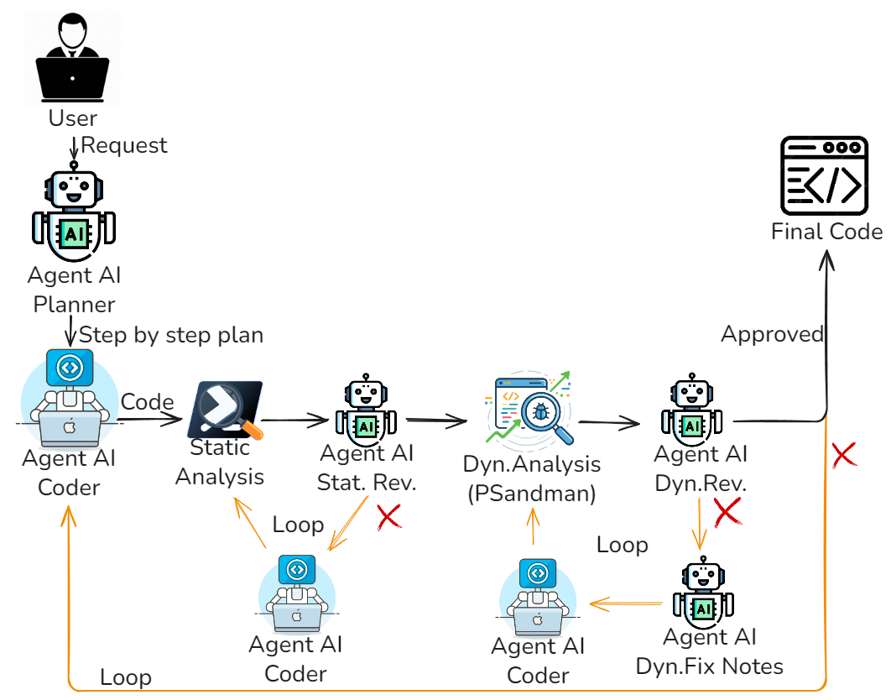

# Overview
Questa cartella contiene la versione `pssai_no_judger` della pipeline multi-agente.

L'architettura usa cinque agenti principali:

- `Planner`: trasforma la richiesta utente in un piano operativo minimale (6-9 passi).
- `Coder`: genera o aggiorna lo script PowerShell eseguibile.
- `Static Analysis Reviewer`: valuta il report di `PSScriptAnalyzer` e produce `fix_notes` mirate.
- `Dynamic Execution Reviewer`: analizza le evidenze runtime generate da `psandman` e decide pass/fail.
- `Change Planner`: produce fix dinamiche da applicare quando la review runtime fallisce.

Il flusso principale e implementato in `multi_agent_architecture.py`.

## Diagramma Architettura


### Flusso di esecuzione
1. Il programma valida `OPENAI_API_KEY`, controlla i path di `psandman`, legge la richiesta CLI e opzionalmente il path `--ref`.
2. Il `Planner` genera il piano canonico; dal piano vengono derivati gli invarianti da mantenere in ogni iterazione.
3. Parte il ciclo globale con gate statico:
   - il `Coder` genera/aggiorna lo script;
   - `PSScriptAnalyzer` valuta il file;
   - in caso di fail, lo `Static Reviewer` produce `fix_notes` e il `Coder` rigenera.
4. Dopo il gate statico, parte il gate dinamico:
   - `psandman` esegue lo script e raccoglie evidenze;
   - il `Dynamic Reviewer` decide pass/fail;
   - se fail, il `Change Planner` produce `fix_notes` runtime e il `Coder` applica la patch su una nuova iterazione.
5. In questa variante non è presente la fase di alignment con `Judger/Aligner`: non viene eseguito confronto semantico con il reference.
6. L'output finale è lo script più recente, insieme al report di osservabilità.

## Esecuzione Rapida
```bash
pip install -r requirements.txt
python multi_agent_architecture.py "Descrizione dello script da generare"
python multi_agent_architecture.py --ref percorso\reference.ps1 "Descrizione dello script da generare"
```
