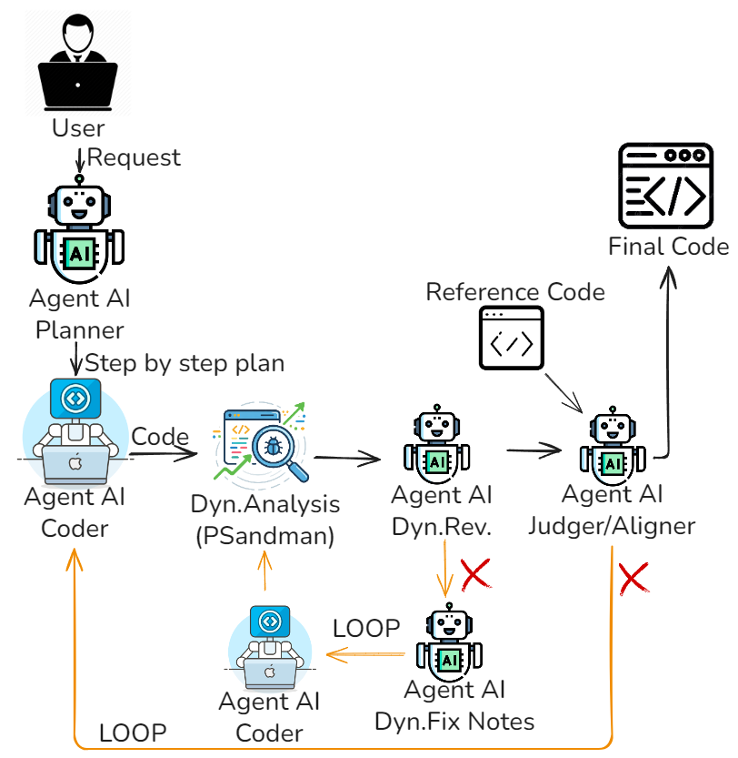

# Overview
Questa cartella contiene la versione `pssai_no_static` della pipeline multi-agente.

L'architettura usa cinque agenti principali:

- `Planner`: trasforma la richiesta utente in un piano operativo minimale (6-9 passi).
- `Coder`: genera o aggiorna lo script PowerShell eseguibile.
- `Dynamic Execution Reviewer`: analizza le evidenze runtime generate da `psandman` e decide pass/fail.
- `Change Planner`: produce fix dinamiche da applicare quando la review runtime fallisce.
- `Code Similarity Aligner`: confronta candidato e reference (`--ref`) per allineamento semantico e strutturale.

Il flusso principale e implementato in `multi_agent_architecture_obs.py`.

## Diagramma Architettura


### Flusso di esecuzione
1. Il programma valida `OPENAI_API_KEY`, controlla i path fissi di `psandman`, legge la richiesta CLI e opzionalmente il file reference (`--ref`).
2. Il `Planner` genera il piano canonico; dal piano vengono derivati gli invarianti da mantenere in ogni iterazione.
3. Parte il ciclo globale e il `Coder` produce una versione dello script.
4. Nel gate dinamico:
   - `psandman` esegue lo script e raccoglie evidenze runtime;
   - il `Dynamic Reviewer` valuta pass/fail sulla base del report compatto;
   - se fail, il `Change Planner` genera `fix_notes` e il `Coder` applica le modifiche su una nuova iterazione.
5. In questa variante non e presente il gate statico con `PSScriptAnalyzer`: la validazione passa da esecuzione dinamica e review LLM.
6. Se e presente `--ref`, viene eseguito lo stage di `Alignment`:
   - se `status=ok`, il flusso termina;
   - se `status=retry`, vengono generate `fix_notes` di allineamento e parte una nuova iterazione globale.
7. A fine esecuzione viene salvato lo script finale e un report di osservabilità.

## Esecuzione Rapida
```bash
pip install -r requirements.txt
python multi_agent_architecture_obs.py "Descrizione dello script da generare"
python multi_agent_architecture_obs.py --ref percorso\reference.ps1 "Descrizione dello script da generare"
```
