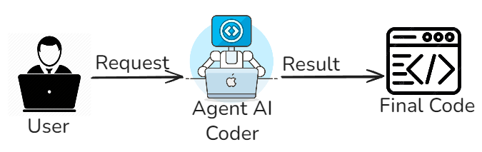

# Overview
Questa cartella contiene la versione `pssai_solo_coder` della pipeline.

L'architettura usa un solo agente:

- `Coder`: genera in un singolo passaggio uno script PowerShell eseguibile a partire dalla richiesta utente.

Il flusso principale e implementato in `multi_agent_architecture.py`.

## Diagramma Architettura


### Flusso di esecuzione
1. Il programma valida `OPENAI_API_KEY` e legge la richiesta da CLI.
2. Viene inizializzato un solo agent `Coder` con un task di generazione diretta dello script `.ps1`.
3. Il `Coder` viene eseguito una sola volta (`single-pass`) e produce il contenuto dello script.
4. L'output LLM viene normalizzato (rimozione eventuali code fence markdown).
5. Lo script finale viene salvato nella cartella corrente.

## Esecuzione Rapida
```bash
pip install -r requirements.txt
python multi_agent_architecture.py "Descrizione dello script da generare"
```
