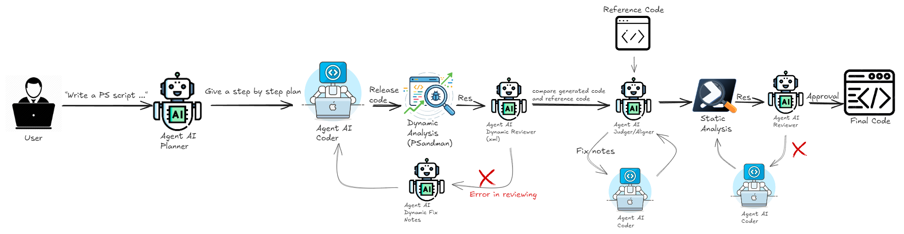

# PSSAI Dynamic Analysis

## Scopo
Lo script implementa un pipeline completo per generare script PowerShell con OpenAI,
eseguirli in una sandbox Windows tramite psandman, analizzare i log dinamici,
e iterare finche la logica risulta coerente con la richiesta.
Se viene fornito un codice di riferimento, effettua anche un allineamento
e un controllo statico post-allineamento con PSScriptAnalyzer.

## Prerequisiti
- Python 3.x
- Dipendenze Python: vedi `requirements.txt` del progetto (minimo `crewai`)
- OpenAI API key in ambiente
- psandman installato nel percorso fisso configurato (vedi sotto)
- PowerShell/Windows per l'esecuzione dinamica
- (Opzionale) PSScriptAnalyzer installato per il gate statico post-allineamento

## Percorsi fissi usati da psandman
Nel file sono presenti costanti con percorsi assoluti:
- `PSANDMAN_BASE_DIR`
- `PSANDMAN_SCRIPT_PATH`
- `PSANDMAN_INPUT_DIR`
- `PSANDMAN_OUTPUT_ROOT`
- `PSANDMAN_OUTPUT_XMLDIR`
- `PSANDMAN_XMLPWSH_DIR`

Lo script copia il file PowerShell generato in `PSANDMAN_INPUT_DIR` e si aspetta
che psandman produca output XML in `PSANDMAN_XMLPWSH_DIR`.
Se `xml-pwsh` non esiste dopo l'esecuzione, il flusso termina con errore.

## Variabili ambiente
Obbligatorie:
- `OPENAI_API_KEY`

Opzionali (modelli):
- `OPENAI_MODEL_PLANNER`
- `OPENAI_MODEL_CODER`
- `OPENAI_MODEL_REVIEW`
- `OPENAI_MODEL_ALIGN`

## Uso da riga di comando
Esempi (PowerShell):
```powershell
python pssai_core_openai.py "Create a PowerShell script that ..."
python pssai_core_openai.py --ref path\to\reference.ps1 "Create a PowerShell script that ..."
python pssai_core_openai.py --guest-user rizz --guest-pass rizz "Create a PowerShell script that ..."
```

Argomenti:
- `--ref <path>`: file PowerShell di riferimento per l'allineamento automatico.
- `--guest-user <user>`: username usato da psandman per la VM guest.
- `--guest-pass <pass>`: password usata da psandman per la VM guest.

Se non passi un prompt, viene usata una richiesta di default (hostname/OS/disk/date).

## Flusso di esecuzione (alto livello)
1. Planning: il Planner (CrewAI) genera un piano in 6-9 bullet.
2. Coding: il Coder genera uno script PowerShell coerente con il piano.
3. Dynamic analysis:
   - lo script generato viene copiato in `PSANDMAN_INPUT_DIR`
   - psandman viene avviato in modalita `--setup --debug`
   - i log XML vengono raccolti da `xml-pwsh`
4. Dynamic review:
   - gli XML vengono compressi in un report compatto (timeline deduplicata)
   - un LLM decide pass/fail sulla base di piano + evidenze
5. Fix loop:
   - se fail, il Change Planner produce fix notes legate al piano
   - il Coder applica le fix notes
   - si ripete fino a `max_auto_fix_iters`
6. Alignment (opzionale):
   - se `--ref` e presente, l'Aligner propone fix notes per avvicinarsi al reference
7. Static gate (post-alignment):
   - esegue PSScriptAnalyzer e itera piccole correzioni se necessario



## Dettagli estrazione eventi (psandman XML)
La classe `PsandmanRunner` estrae eventi dai log XML PowerShell:
- EventID 4104: ScriptBlock logging (testo di script eseguiti)
- EventID 4103: Pipeline execution (comandi + parametri)
- EventID 4100: Error (errori PowerShell)
Eventi diversi non generano `semantic_msg` e vengono scartati.
Gli eventi vuoti o con "Host Name =" vengono filtrati.
Il numero di eventi e limitato da `max_events`.

## Output generati
Lo script salva i risultati nella cartella corrente:
- `generated_<timestamp>_iterX.ps1` (script generati ad ogni iterazione)
- `alignnotes_<timestamp>_roundX.txt` (solo se `--ref` e usato)

I log di psandman vengono ripuliti dopo ogni run:
- input copiato viene rimosso
- `PSANDMAN_OUTPUT_ROOT` viene pulita
- `PSANDMAN_XMLPWSH_DIR` viene eliminata se presente

## Note operative
- Lo script non installa dipendenze; le assume gia presenti.
- Il flusso dinamico e sensibile alla disponibilita di psandman e dei suoi percorsi fissi.
- Se PSScriptAnalyzer non e installato, il gate statico post-allineamento fallira.

## Troubleshooting rapido
- `FileNotFoundError` su PSANDMAN_BASE_DIR: verifica i percorsi fissi nel file.
- `xml-pwsh` mancante: psandman non ha prodotto log, controlla la VM guest.
- Errori OpenAI: verifica `OPENAI_API_KEY` e accesso rete.
