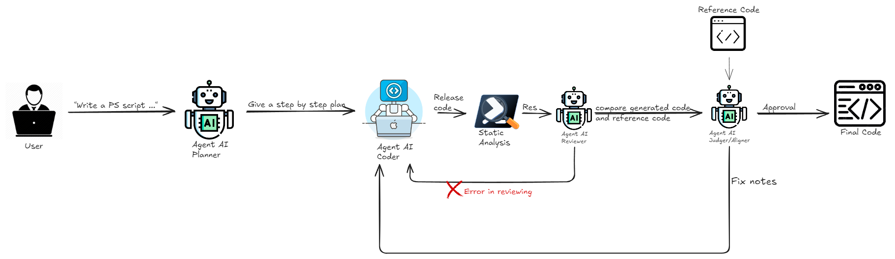

> [!WARNING]
> **DEPRECATO dal 22 marzo 2026**
> Questo componente non e piu mantenuto.
> Usare solo per storico/riproducibilita. Non usare per nuovi sviluppi.

# PSSAI core (OpenAI / Ollama)

Questa cartella contiene gli entrypoint per eseguire il pipeline CrewAI che genera script PowerShell,
con backend OpenAI o con Ollama locale.

## Files
- `pssai_core_openai.py`: usa OpenAI via CrewAI/LiteLLM.
- `pssai_core_ollama.py`: usa Ollama locale (API HTTP + CLI).
- `requirements.txt`: dipendenze Python.

## Requisiti
- Python 3.x
- `pip install -r requirements.txt`
- PSScriptAnalyzer (usato nella fase di analisi; se manca, lo script stampa il comando di installazione)

## Variabili ambiente
OpenAI:
- `OPENAI_API_KEY` (obbligatoria)
- `OPENAI_MODEL_PLANNER`, `OPENAI_MODEL_CODER`, `OPENAI_MODEL_REVIEW`, `OPENAI_MODEL_ALIGN` (opzionali, default `gpt-3.5-turbo`)

Ollama:
- CLI `ollama` installata e nel `PATH`
- modelli richiesti: `dolphin3:8b`, `llama3.1:8b`, `gavineke/powershell-codex:latest`, `nomic-embed-text`
- `OLLAMA_BASE_URL` o `OLLAMA_API_BASE` (opzionali, default `http://localhost:11434`)

## Uso
Esempi (PowerShell):
```powershell
python pssai_core_openai.py "Create a PowerShell script that ..."
python pssai_core_openai.py --ref path\to\reference.ps1 "Create a PowerShell script that ..."
python pssai_core_ollama.py "Create a PowerShell script that ..."
```

## Flusso di esecuzione (alto livello)
1. Planning: il Planner genera un piano in 6-9 bullet.
2. Coding: il Coder produce lo script PowerShell secondo il piano.
3. Static analysis: PSScriptAnalyzer valuta lo script.
4. Review e fix loop: se ci sono problemi, il Reviewer genera fix notes e il Coder rigenera lo script (fino a `max_auto_fix_iters`).
5. Alignment opzionale: se usi `--ref`, l'Aligner propone fix notes per avvicinare lo script al riferimento, con nuova verifica statica.



## Output
- `generated_<timestamp>_iterX.ps1` salvato nella cartella corrente
- `alignnotes_<timestamp>_roundX.txt` quando usi `--ref`

## Note
- Lo script imposta `OLLAMA_KEEP_ALIVE=0` e `CREWAI_STORAGE_DIR=./crewai_storage`.
